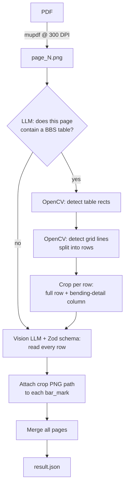

# pdf_extract

Extracts **Bar Bending Schedules (BBS)** from structural engineering drawings (PDF) into structured JSON, using computer vision for table geometry and vision LLMs for reading values.

Ships as both a one-shot CLI script and a small multi-user web app.

---

## What problem this solves

Reinforcement drawings issued by structural consultants carry a **Bar Bending Schedule** — a table listing every steel bar in a concrete element:

| Bar mark | Dia (mm) | Qty | Cutting length | A | B | Total weight | Bending detail |
|----------|----------|-----|----------------|---|---|--------------|----------------|
| V1 | 8 | 32 | 3270 | – | – | 41.29 | *(shape drawing)* |
| V2 | 12 | 8 | 3270 | – | – | 23.23 | *(shape drawing)* |

Quantity surveyors re-key these by hand into estimation software. This project reads the drawing and emits the same rows as JSON, and additionally **crops the bending-detail shape drawing for each row** into its own PNG, so the shape stays linked to its bar mark.

A plain "send the page to an LLM" approach loses the shape drawings (they are pictures, not text) and mis-associates rows on dense multi-table sheets. Hence the hybrid: OpenCV finds the table grid, the LLM reads the values.

---

## Pipeline



Steps 3–5 (`classify → crop`) run as a two-node LangGraph state machine in [`src/langgraph.ts`](src/langgraph.ts). The classifier gate exists because a drawing set is mostly plans and sections; only a few sheets carry a schedule, and running the CV + extraction stage on the rest wastes tokens.

---

## Two entry points

The repo has **two runners that take different paths through the same modules**.

### 1. CLI — `index.ts`

```bash
bun run index.ts
```

Reads a hardcoded `./input/i1.pdf`, writes to `output/<timestamp>/`, prints total runtime.

After the CV row-crop step it runs a **second LLM pass** (`cropperBatch` → `cropper` in [`src/imageExtractor.ts`](src/imageExtractor.ts)) that looks at each row image and issues tool calls to crop out the bending-detail cell precisely. These crop calls are batched 4-at-a-time (`CROP_CONCURRENCY`).

### 2. Web server — `server.ts`

```bash
bun run server.ts     # http://localhost:3000
```

Multi-user: register/login, create projects, upload a PDF per project, poll for progress, view results in the browser.

The server **skips the LLM cropper entirely**. `cropTableRows` in [`src/bbs.ts`](src/bbs.ts) already isolates the rightmost column (the bending-detail column) geometrically, so the server passes `row.bendingDetailsPath` straight through ([`server.ts:77`](server.ts#L77)). Cheaper and more deterministic.

> **Which one is current?** The server path. `index.ts` retains the older LLM-cropper stage.

---

## Setup

Requires [Bun](https://bun.com) (developed on 1.3–1.4).

```bash
bun install
```

Create `config.json` in the repo root — it is gitignored and **not** committed:

```json
{
  "OPENROUTER_API_KEY": "sk-or-v1-...",
  "CROPPER_MODEL": "openai/gpt-5.6-luna",
  "EXTRCAT_MODEL": "openai/gpt-5.6-luna-pro",
  "EMBEDDING_MODEL": "nvidia/llama-nemotron-embed-vl-1b-v2:free"
}
```

| Key | Used for |
|-----|----------|
| `OPENROUTER_API_KEY` | All model calls, via OpenRouter |
| `CROPPER_MODEL` | Page classification + the LLM crop agent (cheaper model) |
| `EXTRCAT_MODEL` | Final structured extraction (stronger model). *Note: the key is misspelled in code — it is `EXTRCAT`, not `EXTRACT`.* |
| `EMBEDDING_MODEL` | Declared but currently unused |

Environment variables:

| Var | Default | Notes |
|-----|---------|-------|
| `JWT_SECRET` | `pdf-extract-secret-key-2024` | **Set this in production.** |

Docker:

```bash
docker build -t pdf-extract .
docker run -p 3000:3000 pdf-extract
```

---

## HTTP API

All `/api/projects*` routes require `Authorization: Bearer <jwt>`. Tokens last 7 days.

| Method | Path | Body / Params | Returns |
|--------|------|---------------|---------|
| `POST` | `/api/auth/register` | `{ email, password, name? }` | `{ token, user }` |
| `POST` | `/api/auth/login` | `{ email, password }` | `{ token, user }` |
| `GET`  | `/api/auth/me` | – | `{ user }` |
| `GET`  | `/api/projects` | – | `{ projects[] }` |
| `POST` | `/api/projects` | `{ name }` | `{ project }` (201) |
| `GET`  | `/api/projects/:id` | – | `{ project }` with `result` parsed |
| `DELETE` | `/api/projects/:id` | – | `{ success }` |
| `POST` | `/api/projects/:id/upload` | multipart `file` | `{ success }` — extraction starts in background |
| `GET`  | `/api/projects/:id/status` | – | `{ status, progress, hasResult }` |

Static routes: `/` and `/login`, `/dashboard`, `/project?id=N`, plus `/output/*` which serves generated crop PNGs so the UI can display them.

Upload is fire-and-forget: `runExtraction()` is deliberately not awaited, and it writes progress strings into the `projects` row as it goes. The frontend polls `/status` on an interval.

**Project status values:** `created` → `processing` → `completed` | `failed`.

---

## Data model

SQLite via `bun:sqlite`, file `data.db`, WAL mode. Created on boot by `connectDB()` in [`src/db.ts`](src/db.ts).

```
users     id, email (unique), password (bcrypt, 10 rounds), name, created_at
projects  id, user_id → users.id, name, status, extraction_progress,
          result (JSON text), output_path, pdf_path, created_at
```

Uploaded PDFs land in `uploads/<projectId>/<timestamp>_<filename>`. Rendered pages and crops land in `output/<timestamp>/`.

---

## Output format

Defined by Zod in [`src/schema/extractSchema.ts`](src/schema/extractSchema.ts); the schema doubles as the LLM's structured-output contract, so the field `.describe()` strings are effectively prompt text.

```jsonc
{
  "project_name": "EMC PLOT - WORKMEN ACCOMMODATION BLOCK",
  "structure_consultant": "TRC ENGINEERING (I) PVT LTD",
  "drawing_no": "EAI_GW_16",
  "date": "24-07-2026",
  "rev": "00",
  "element_name": "EA1_GW_16_M",
  "element_number": "03",

  "plate": [ /* plate/lug table, when the sheet has one */ ],

  "columns": [
    {
      "bar_mark": "V1",
      "diameter": 8,
      "qty": 32,
      "length": 3270,              // cutting length
      "total_bar_length": 104640,
      "total_weigth": 41.29,       // sic — misspelled in the schema
      "crop_image": "output/20260831_072011/crops/crop_1788160941378_35jyii4j.png",
      "data": {                    // free-form bending dimensions
        "A": null, "B": null, "C": null,
        "bar_shape_code": "SB100"
      }
    }
  ]
}
```

Notes on the shape:

- `columns` is the bar list — the name is historical, it is **rows**, one object per bar mark.
- `data` is an open record because bending dimension labels vary by drawing (`A`,`B`,`C`,`C1`,`D2`,…). Items with no bending geometry (sleeves, couplers) get a description string here instead.
- `crop_image` is injected by code, not by the model — see below.
- Numeric fields use `z.coerce.number()`, so the model may return `"8"` and it becomes `8`.
- Two spellings are baked in and load-bearing: `total_weigth` and the config key `EXTRCAT_MODEL`.

Multi-page merge ([`src/schema/mergeExtraction.ts`](src/schema/mergeExtraction.ts)): header fields take the **first non-null value** across pages; `plate` and `columns` arrays are concatenated.

---

## How the table detection works

[`src/bbs.ts`](src/bbs.ts) is the core of the project and uses no LLM at all. It runs OpenCV (`@techstark/opencv-js`, WASM) with Sharp for image decoding.

**Finding tables** (`detectTables`):

1. Convert to grayscale, adaptive-threshold (Gaussian, inverted).
2. Isolate horizontal lines with a wide-and-1px-tall morphological open (kernel ≈ page width / 30).
3. Isolate vertical lines the same way (kernel ≈ page height / 20).
4. OR the two masks, dilate 3×3 to close gaps at line junctions.
5. `findContours` with `RETR_LIST`, take bounding rects.
6. Filter: keep rects between 20 % and 80 % of page width and 20 %–90 % of page height — this drops the page border, the title block, and stray text.
7. Score each candidate by line-pixel density inside it; require both horizontal **and** vertical lines present. A block of text has neither.
8. De-duplicate with IoU > 0.8, sort top-to-bottom then left-to-right.

**Splitting into rows** (`cropTableRows`):

1. Crop the table rect, Otsu-threshold it.
2. Detect horizontal grid lines with a kernel ≈ **half the table width** — text vanishes, only real borders survive. Cluster adjacent y-values into single lines.
3. Do the same for vertical lines.
4. Skip the first `headerRows` lines (default **3**: schedule title, bending-dimension legend, column headers).
5. Between each consecutive pair of lines, crop the full row, and separately crop the region between the **last two vertical lines** — that is the bending-detail column.
6. Rows shorter than 20 px are dropped as line noise.

With `debug: true` (the default) it also writes `debug_tables.png` — the source page with every detected table outlined and labelled. Start there when detection misbehaves.

---

## Tuning knobs

| Knob | Where | Default | Effect |
|------|-------|---------|--------|
| `headerRows` | `cropBbsRows` options | `3` | Non-data rows skipped at the top of each table. **The most common thing to change** — layouts with a different title block need a different value. |
| `rowPadding` | same | `1` px | Slack around each row crop. |
| `debug` | same | `true` | Writes `debug_tables.png`. |
| `dpi` | `convertPdfToImages` | `300` | Render resolution. Lower loses thin grid lines. |
| `maxDim` | `compressImage` | `1500` px | Images are downscaled before being sent to the model. |
| `CROP_CONCURRENCY` | `index.ts` | `4` | Parallel LLM crop calls. |
| `maxCropCalls` | `imageExtractor.ts` | `1` | Tool-call turns the crop agent gets. **Currently 1 — was 40.** |
| `MAX_RETRIES` / `BACKOFF_MS` | `api_helpers.ts` | `3` / `5000` | Retry on `429`, `503`, `ECONNRESET`, timeouts. |

---

## File map

| Path | Role |
|------|------|
| [`index.ts`](index.ts) | CLI runner. Hardcoded input path. |
| [`server.ts`](server.ts) | Bun.serve HTTP API, auth, project CRUD, background extraction. |
| [`test.ts`](test.ts) | Ad-hoc scratch script for `cropBbsRows` against a fixed image. Not a test suite. |
| [`src/pdfToImage.ts`](src/pdfToImage.ts) | mupdf render to PNG, with optional DPI clamping to a pixel budget. |
| [`src/langgraph.ts`](src/langgraph.ts) | LangGraph: `classify_image` → conditional → `crop_bbs_rows`. |
| [`src/bbs.ts`](src/bbs.ts) | OpenCV table + row detection and cropping. The real work. |
| [`src/extractor.ts`](src/extractor.ts) | Vision LLM call with Zod structured output; attaches crop paths to bar marks. |
| [`src/imageExtractor.ts`](src/imageExtractor.ts) | LLM crop agent (`cropper`) and its batched wrapper (`cropperBatch`). CLI path only. |
| [`src/db.ts`](src/db.ts) | SQLite connection and schema bootstrap. |
| [`src/schema/extractSchema.ts`](src/schema/extractSchema.ts) | Output contract. |
| [`src/schema/imageSchema.ts`](src/schema/imageSchema.ts) | Crop tool-call arguments. |
| [`src/schema/mergeExtraction.ts`](src/schema/mergeExtraction.ts) | Multi-page merge. |
| [`src/prompts/extract_prompt.txt`](src/prompts/extract_prompt.txt) | Main extraction prompt. Emphasises **row-wise, never column-wise** reading. |
| [`src/prompts/crop_prompt.txt`](src/prompts/crop_prompt.txt) | Crop-agent prompt. |
| [`src/prompts/crop.txt`](src/prompts/crop.txt) | Older crop prompt, unreferenced. |
| [`src/utils/api_helpers.ts`](src/utils/api_helpers.ts) | `compressImage`, `withRetry`, `mapBatched`. |
| [`src/utils/image.ts`](src/utils/image.ts) | Base64 data-URI encoding. |
| [`src/utils/normalizeCoords.ts`](src/utils/normalizeCoords.ts) | Accepts pixel **or** normalised coords from the model and returns 0–1. |
| [`src/tools/zoomTool.ts`](src/tools/zoomTool.ts) | Crop + upscale small crops to ~1200 px so the model can read them. |
| [`src/tools/opencv.ts`](src/tools/opencv.ts) | OpenCV WASM init. |
| [`public/`](public) | Three vanilla-HTML pages: login, dashboard, project. No build step. |

---

## Crop-to-row matching

Worth calling out because it is subtle. The model returns bar marks; the cropper returns labelled PNGs. `attachCropImages` in [`src/extractor.ts`](src/extractor.ts) joins them with a three-tier fallback:

1. Exact match on lowercased/trimmed `bar_mark`.
2. Crop key **contains** the bar mark.
3. Bar mark **contains** the crop key (crop key ≥ 2 chars, to avoid junk matches).

Unmatched bar marks log a warning and get `crop_image: null`. If crops are landing on the wrong rows, this function is where to look.

---

## Testing

```bash
bun test
```

Coverage is currently thin — only [`src/utils/api_helpers.test.ts`](src/utils/api_helpers.test.ts), covering batch ordering and failure isolation. The CV pipeline has no automated tests; `test.ts` is a manual scratch script, not part of `bun test`.

---

## Known issues

Recorded honestly so they are not rediscovered:

1. **`data.db` is committed to git**, including user emails and bcrypt password hashes. It should be gitignored and purged from history.
2. **Path traversal** — `/public/*` and `/output/*` join the request pathname onto a base directory with no normalisation, so `..` segments are not rejected.
3. **`JWT_SECRET` has a hardcoded fallback.** Fine locally, unsafe deployed.
4. **`index.ts` input path is hardcoded** to `./input/i1.pdf`; no CLI argument.
5. **`maxCropCalls` is `1`**, down from `40`. The crop agent gets a single tool-call turn, so on the CLI path it will crop far fewer cells than a full schedule needs.
6. **~140 lines of commented-out dead code** in `src/extractor.ts`, including a corrupted paste around line 206 that duplicates a function mid-string.
7. **Four pre-existing TypeScript errors** in `src/imageExtractor.ts` (LangChain `tool_calls` arg/id typing). `bunx tsc --noEmit` is not clean.
8. **`headerRows` is fixed at 3** and not inferred, so a drawing with a different header layout silently drops or includes wrong rows.
9. **No upload validation** — file type and size are unchecked on `/upload`.
